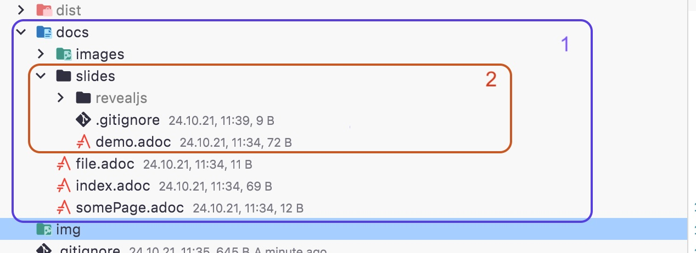

# Asciidoctor Github Pages Template

## Converting



1. will be converted into asciidoc format
2. will be converted into asciidocs slides

## Action

GitHub Actions will automatically convert the `.adoc` files into html document. You can configure the input and 
output path with the environmental variables at the top of the actions.

> Note: This will not change the configuration for the scripts

```yaml
jobs:
  build:
    name: Build & Publish 🚀
    runs-on: ubuntu-latest
    env:
      INPUTPATH: docs
      OUTPUTPATH: dist
      SLIDES: true
      BRANCH: gh-pages
```

|              | INPUTPATH | OUTPUTPATH | SLIDES         | BRANCH  |
|--------------|-----------|------------|----------------|---------|
| type         | string    | string     | boolean        | string  |

## Directory Trigger

After changing the input path make sure to also change the directory trigger at the top of the file.

```yaml
on:
  push:
    branches:
      - 'main'
    paths:
      - docs/**
```

Just change docs to the prefered input directory.

## Scripts

Sometimes it is useful to just convert or push it locally for a quick update. In the root directory are two scripts

### Convert

This script will just convert it into the ouput directory. See table below for the parameters..

```shell
./convert.sh <input-dir> <output-dir> <slides-convert>
```

### Publish
This script will convert the documents and publish them to the gh-pages branch. See table below for the parameters.

```shell
./publish.sh <input-dir> <output-dir> <slides-convert>
```

### Config

You can configure the inut and output dir in the `config.sh` file. 

|              | input-dir | output-dir | slides-convert |
|--------------|-----------|------------|----------------|
| isOptional   | true      | true       | true           |
| defaultValue | input     | output     | true           |
| type         | string    | string     | boolean        |
